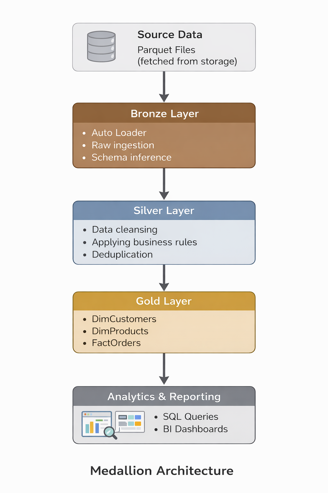
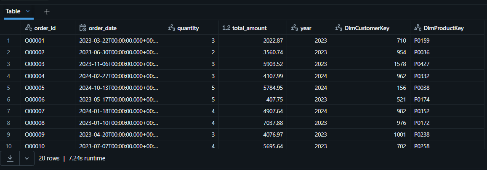

# Databricks End-to-End Data Engineering Pipeline

An end-to-end data engineering project built on Databricks using the
Medallion Architecture (Bronze, Silver, Gold) and Delta Lake to build
an analytics-ready data model.

---

## Architecture

The pipeline follows a Medallion Architecture pattern:

- **Bronze**: Incremental ingestion of raw data using Auto Loader  
- **Silver**: Data cleansing, validation, and business transformations  
- **Gold**: Analytics-ready dimensional model with fact and dimension tables  

---

## Tech Stack

- Databricks
- Apache Spark (PySpark)
- Delta Lake
- Delta Live Tables (DLT)
- Unity Catalog

---

## Key Features

- Incremental ingestion using Auto Loader
- Data quality enforcement using DLT expectations
- Surrogate key-based dimensional modeling
- Idempotent MERGE logic for fact tables
- Configuration-driven pipeline design
- GitHub-backed Databricks Repos for version control

---

## Project Structure

bronze/ -> Raw data ingestion
silver/ -> Cleansed and conformed data
gold/ -> Fact and dimension tables
configs/ -> Configuration and path abstraction

---

## Execution

The pipeline is orchestrated using Databricks Jobs and includes a
Delta Live Tables (DLT) pipeline for managing data quality and
transformations. The solution supports both initial and incremental
loads.

---

## Sample Output

Below is a preview of the final Gold fact table produced by the pipeline:

---

## Pipeline Execution

Screenshots below show the pipeline DAG and a successful execution run:

- Databricks Job DAG
- Successful pipeline run
- Gold fact table preview

(See the `screenshots/` folder for details.)